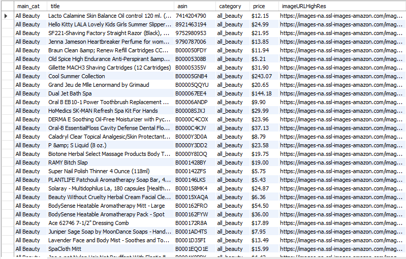
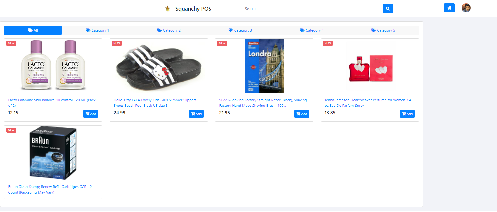

# aw06

[Amazon Review Data (2018)](https://nijianmo.github.io/amazon/index.html) has a huge products metadata set of multiple categories.

|category| reviews | metadata |
|--| -- | -- |
|Amazon Fashion|reviews (883,636 reviews)|metadata (186,637 products)|
|All Beauty|reviews (371,345 reviews)|metadata (32,992 products)|
|Appliances|reviews (602,777 reviews)|metadata (30,459 products)|
| ... |
|Tools and Home Improvement|reviews (9,015,203 reviews)|metadata (571,982 products)|
Toys and Games|reviews (8,201,231 reviews)|metadata (634,414 products)|
Video Games|reviews (2,565,349 reviews)|metadata (84,893 products)|

Please finish the following tasks:

- Download no less than two categories of these metadata.
- Referring the example code in this repo, convert each line in the downloaded files into a POJO of `Product` class and save the object in a database like MySQL. 
- Integrate the database containing Amazon products with your own AW04 project and build an Amazon WebPOS system.

And, of course, always try to make the system run as fast as possible.

------

本次作业主要内容为将从amzon数据库中下载的json格式数据文件通过处理导入数据库中进行商品信息的持久化存储，再以aw04为基础将原本的读取京东数据库改为读取本地存储的数据库得到商品信息，并在pos网站中展现出来。

在导入数据库阶段，主要是修改demo中的资源文件位置以及在Writer中配置数据库的连接，以及对于提取的数据进行筛选后再写入数据库。

我选取了all_beauty与software数据集，读入数据库结果展示如下：

此时再配置aw04，仿照JD文件中读取京东资源库的方式，再次建立起与本地数据库的连接，将数据读取并保存到product中即可。但是我在此处遇到了一些问题无法解决，即我认为我的本地数据库中数据格式没问题，也能够正确的读取数据，但加载网页只会显示五个商品并且编译器开始报关于index.html的错误。由于本人前端知识匮乏，所以暂时未能解决：

